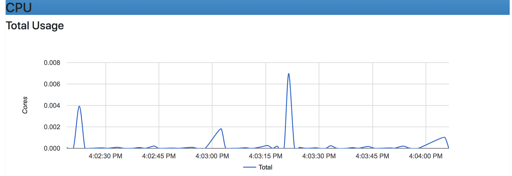
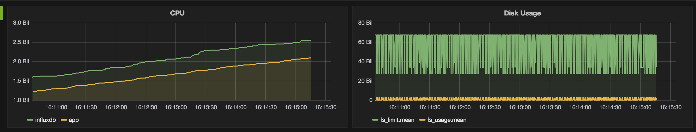
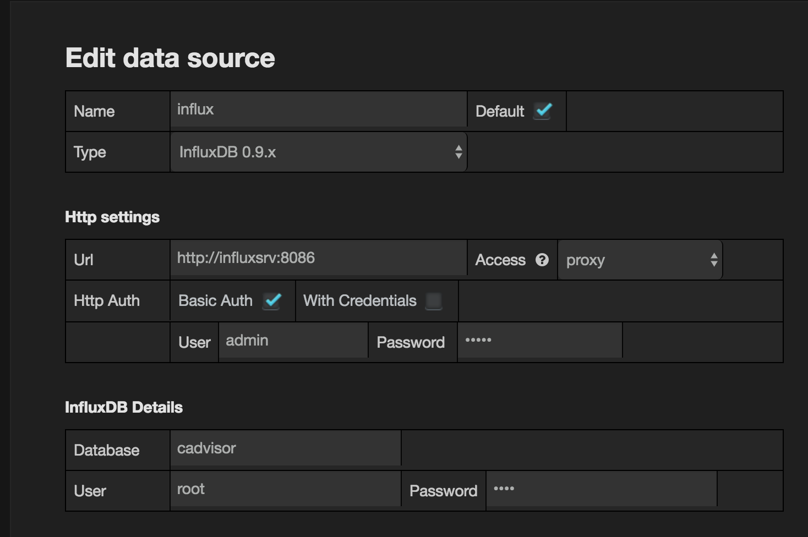

# devops-takehome
Simple flask + sqlalchemy app

## Requirements
Docker Engine and Docker Compose are required to run this code.

I performed my development on an macOS High Sierra 10.13.6 host with Docker Desktop Community v2.0.0.3
- Engine 18.09.2
- Compose 1.23.2

Other tools needed to build and run tests:
- GNU Make 3.81
- curl 7.61.1

## Test the application
I chose GNU Make to manage my development lifecycle to build, run and test this demo.

    $ make test

The **test** Make target will create the app container image, start the app and postgres containers using docker-compose, and then execute three curl commands to exercise the API as shown below.


## Interact with the API
POST a message to the API:
```bash
curl -X POST http://127.0.0.1:5000/message -H "Content-Type: application/json" --data '{"message": "hi"}'
```

GET a message
```bash
curl http://127.0.0.1:5000/message/1
```

HEALTHCHECK
```bash
curl http://127.0.0.1:5000/healthcheck
```

## Monitoring
I did not write my own data collection tools because there already exist many suitable tools for that purpose. I have included a __monitor.yml__ docker compose configuration to demonstrate some monitoring options. You can start the monitoring tools with:

        $ make run YAML='monitor.yml'

The most basic metric collection available is `docker stats` which is built into the docker engine and provides metrics on cpu, memory, disk, and network stats.  However, these data are only displayed on the terminal, not persisted.

        $ docker stats

        CONTAINER ID   NAME                    CPU %   MEM USAGE / LIMIT     MEM %  NET I/O          BLOCK I/O           PIDS
        98b46bf616e7   devops-takehome_web_1   0.37%   50.45MiB / 1.952GiB   2.52%  6.51kB / 4.64kB  0B / 0B             3
        027c674a3f71   devops-takehome_db_1    0.31%   13.67MiB / 1.952GiB   0.68%  5.94kB / 5.39kB  20.5kB / 123MB      9

1. `CONTAINER ID` and `Name`: the ID and name of the container
1. `CPU %`and `MEM %`: the percentage of the host’s CPU and memory the container is using
1. `MEM USAGE / LIMIT`: the total memory the container is using, and the total amount of memory it is allowed to use
1. `NET I/O`: The amount of data the container has sent and received over its network interface
1. `BLOCK I/O`: The amount of data the container has read to and written from block devices on the host
1. `PIDs`: the number of processes or threads the container has created

More information about this tool can be found at [docker stats](https://docs.docker.com/engine/reference/commandline/stats/)

These hardware metrics are important to watch because they provide the most basic indications of system health and can help to identify over and under-subscribed resources in need of improvement to increase performance and efficiency, and possibly to reduce costs. For each resource, physical functional components such as cpu, memory, disk, we are interested in determining their `utilization`, `saturation`, and `errors`.
According to [The Use Method](http://www.brendangregg.com/usemethod.html) by Brendan Gregg, these are defined as:

        - utilization: the average time that the resource was busy servicing work
        - saturation: the degree to which the resource has extra work which it can't service, often queued
        - errors: the count of error events

For example, we might want to be notified if cpu usage is consistently over some threshold, perhaps 90% or if there are sudden increases that can be correlated with increased application response time, i.e. saturation.

Building on top of docker stats we have [cadvisor](https://hub.docker.com/r/google/cadvisor/) which provides graphical display of docker stats output.

<br>
<div align='center'>

<b>Figure 1 - cadvisor CPU</b>
</div>
<br>

Nice, but still no persistent storage for trend analysis. For this we need a database. The cadvisor dashboard is available through your browser:

        http://localhost:8080/docker/


[InfluxDb](https://www.influxdata.com/) is an example of a time series database suitable for persisting docker performance metrics. Cadvisor can be configured to use this database.

For a more powerful and expressive option for viewing and monitoring metrics is [Grafana](https://grafana.com/). This tool greatly improves the experience over cadvisor and latest versions provide alerting and annotation features. Access to historical data is only limited by the amount of disk space available. It is generally sufficient to use a maximum collection granularity of 1 minute intervals and in practice these are averaged over some larger time period to reduce the disk storage requirements.

<br>
<div align='center'>

Figure 2 - grafana dashboard
</div>
<br>

Grafana requires some post installation configuration to make the necessary connections with InfluxDb which can be found in this [blog post](https://www.brianchristner.io/how-to-setup-docker-monitoring/). You can login using 'admin:admin'.

        http://localhost:3000/

<br>
<div align='center'>

Figure 3 - grafana/influx configuration
</div>
<br>

There are many other options including web-hosted solutions. This [post](https://code-maze.com/top-docker-monitoring-tools/) might be helpful.

Remember, the data provided by `docker stats` is only related to the running containers. It doesn't tell us about the physical host running the docker engine and application performance is also important. A production quality monitoring system needs to inlude all of these metric sources, but for that we need other tools which include `Application Performance Monitors`, or APM. Examples are [New Relic](https://newrelic.com/) and [APPDYNAMICS](https://www.appdynamics.com/) which add many more metrics types associated with running code and the hardware metrics of hosts and containers.

Once you are collecting metrics then you can connect these tools with notification and alerting systems such as [PagerDuty](https://www.pagerduty.com/) and [Slack](https://slack.com/) so that engineers can take corrective action when performance thresholds are execeeded.

When you are finished with the monitoring demo apps you can cleanup the deployment with:

        $ make clean YAML='monitor.yml'
